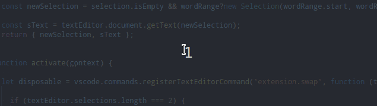
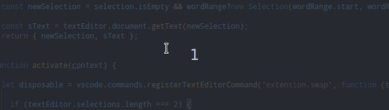
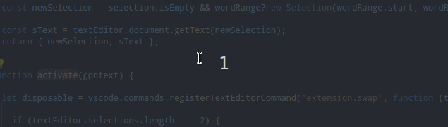

# Swap Selection with Clipboard

Swap the Clipboard string(previously copied string) with a Selected string/a Pointed word in code or Swap two selected string/poited word, with multiselection in code.

## Features

### **How it work (descriptions):**

With Two Multiselection in code:  

* In the code, `Select a string`/`Point a word` - in **two places** with multiselection (`Alt+Select/Click`).
* Use `Alt+S` to swap these strings.

With One Selection in code and Clipboard:  

* In the code, `Select a string`/`Point a word` - in **one place**, without multiselection.
* Use `Alt+S` to swap this string with the string from the clipboard(previously copied string).

`Point a word` means clicking it without selecting it. The extension will `automatically select pointed word` when you press `Alt+ S` to swap.

### **How it work (on GIFs):**

#### Swap pointed word with clipboard string - Click on one word, Alt+S to swap:

#### Swap selected string with pointed word  - Select string, Alt+Click on one word and Alt+S to swap:

#### Swap pointed words - Click on first word, Alt+Click on second word and Alt+S to swap:

  

## Known Issues

Insignificant Bug:

* A longer string is incorrectly marked when you quickly press Alt+S 3 times, while the strings are of different length.

## Release Notes

### 1.1.0

Create extension.
