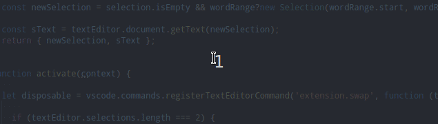
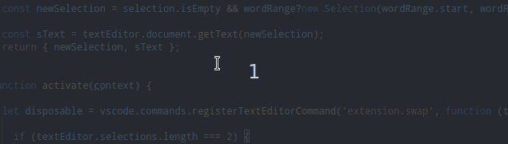
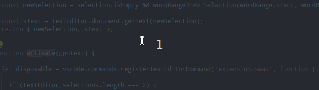

# Swap Selection with Clipboard

Swap the Clipboard string(previously copied string) with a Selected strings/a Pointed words in code or Swap two selected strings/poited words, with multiselection in code.

## Features

### **How it work descriptions (text):**

**With One Selection in code and Clipboard:** 

* In the code, `Select a string`/`Point a word` - in **one place**, without multiselection.
* Use `Alt+S` to swap this string with the string from the clipboard(previously copied string).

**With Double Multiselection in code:**  

* In the code, `Select a string`/`Point a word` - in **two places** with multiselection (`Alt+Select/Click`).
* Use `Alt+S` to swap these strings.

`Point a word` means clicking word without selecting it.  
Then, the extension will `automatically select pointed word` when you press `Alt+S` to swap.

### **How it work examples (on GIF-s):**

**Swap pointed word with clipboard string - Click on one word and Alt+S to swap:**

**Swap selected string with pointed word  - Select string, Alt+Click on some word and Alt+S to swap:**

**Swap pointed words - Click on first word, Alt+Click on second word and Alt+S to swap:**

  

## Reason for creation. In what helps

I wanted to read the VS Code extension API when creating a simple extension.

When I want to swap two strings in one file - Swap Selected strings/Pointed words is helpful. ([Why not other ready extensions?](#Similar-extensions))

Without this extension:

1. select first string
1. cut string
1. point place to paste
1. paste
1. select second string
1. cut string
1. point place to paste
1. paste

With this extension:

1. select first string/point word
1. select second string/point word
1. use `Ctrl+S`

When I want to swap thongs in two different files - Swap Clipboard string with Selected string/Pointed word is helpful.

Without this extension:

1. select string
1. cut string
1. switch tab
1. point place to paste
1. paste
1. select string
1. cut string
1. switch tab
1. paste

With this extension (less spectacular difference):

1. select string/point word
1. cut string
1. switch tab
1. select string/point word
1. use `Ctrl+S`
1. switch tab
1. paste

## Known Issues

Insignificant Bug:

* A longer string is incorrectly marked when you quickly press Alt+S 3 times, while the strings are of different length.

## Release Notes

### 1.2.6

Update dependencies.

### 1.2.3

Activate an extension at the startup.

### 1.1.0

Create extension.

## Similar extensions

I will list similar extensions here, and why they are not enough for me.

* **[transpose](https://marketplace.visualstudio.com/items?itemName=v4run.transpose
)** by `Varun Vasan V`

  * In this extension, is possible to swap selected strings.
  * In this extension, is not possible to swap a word with a clipboard string.
  * In this extension, is not possible to swap pointed word: swaps the two letters between which the cursor, instead of the pointed words.
  * In this extension, you have the ability to swap more than two selected strings, but I do not know what it can be useful for.

* **[Copy Swapper](https://marketplace.visualstudio.com/items?itemName=berickson324.copyswapper)** by `berickson324`

  * In this extension, is possible to swap clipboard string with selected string.
  * In this extension, is not possible to swap clipboard string with pointed word.
  * In this extension, is not possible to swap two selected strings/pointed words.

* **[swap-word](https://marketplace.visualstudio.com/items?itemName=davidmart.swap-word)** by `davidmart`

  * In this extension, is possible to swap two selected strings/pointed words.
  * In this extension, is not possible to swap clipboard string with selected string.

In addition, I wanted to use one keyboard shortcut for all these operations `Alt+S`.  
If you used several complementary extensions (E.g. Copy Swapper and swap-word), the shortcuts would conflict with each other.
